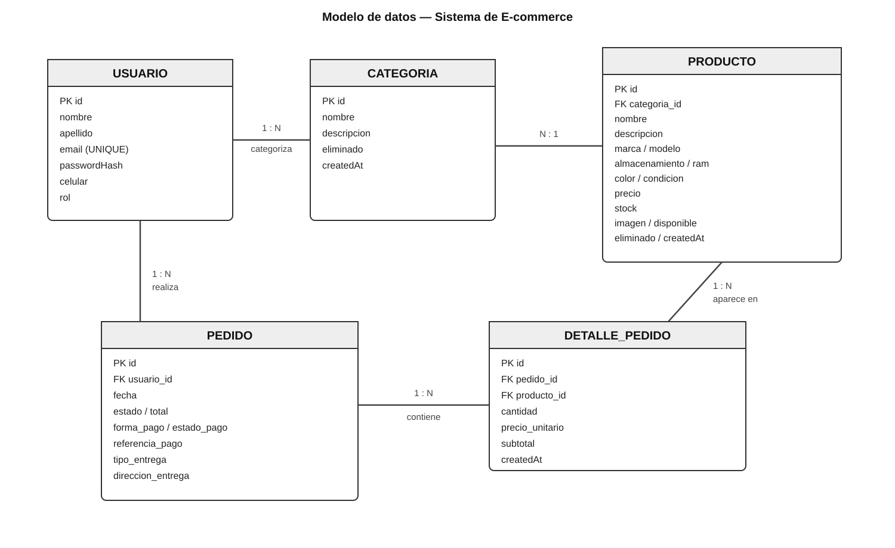

# Modelo de datos

## 1. Objetivo

El modelo de datos del sistema representa las operaciones principales del e-commerce: usuarios, categorías, productos, pedidos y el detalle de cada pedido.

El diseño toma como base la propuesta inicial del TFI y la estructura de dominio desarrollada previamente, pero incorpora los datos necesarios para el nuevo contexto del proyecto: celulares nuevos y usados, accesorios, stock, retiro/envío, pago online y conservación del precio histórico.

La solución utiliza una base de datos relacional SQL y será persistida mediante JPA/Hibernate desde el backend Spring Boot.

## 2. Criterios de diseño

- Mantener un modelo relacional simple, adecuado al tamaño inicial del emprendimiento.
- Evitar entidades que no aporten valor al MVP.
- Mantener separadas las responsabilidades de usuario, catálogo y pedidos.
- Conservar en cada detalle de pedido el precio aplicado al momento de la compra.
- Asociar cada pedido con el usuario que lo realizó.
- Asociar cada producto con una categoría.
- Permitir gestionar stock desde el producto.
- Registrar dentro del pedido la modalidad de entrega y, cuando corresponda, los datos necesarios para el envío.
- Registrar el resultado del pago online sin acoplar el modelo a un proveedor externo concreto.

## 3. Entidades principales

### 3.1 Usuario

Representa a las personas que utilizan el sistema.

Campos principales:

| Campo | Tipo conceptual | Restricciones | Descripción |
|---|---|---|---|
| id | Long | PK | Identificador del usuario |
| nombre | String | NOT NULL | Nombre |
| apellido | String | NOT NULL | Apellido |
| email | String | NOT NULL, UNIQUE | Correo utilizado para autenticación |
| passwordHash | String | NOT NULL | Contraseña almacenada de forma segura |
| celular | String | | Número de contacto |
| rol | Enum | NOT NULL | `CLIENTE` o `ADMIN` |
| eliminado | Boolean | NOT NULL | Baja lógica |
| createdAt | DateTime | NOT NULL | Fecha de creación |

La contraseña no debe almacenarse en texto plano. El campo representa conceptualmente el valor obtenido mediante un mecanismo de hash seguro.

### 3.2 Categoría

Representa una clasificación del catálogo.

Campos principales:

| Campo | Tipo conceptual | Restricciones | Descripción |
|---|---|---|---|
| id | Long | PK | Identificador |
| nombre | String | NOT NULL | Nombre de la categoría |
| descripcion | String | | Descripción |
| eliminado | Boolean | NOT NULL | Baja lógica |
| createdAt | DateTime | NOT NULL | Fecha de creación |

Para el MVP, cada producto pertenece a una categoría. Esta decisión mantiene el modelo simple y es suficiente para las funcionalidades de catálogo, búsqueda y filtrado previstas.

### 3.3 Producto

Representa una unidad comercial del catálogo. Para el alcance inicial se considera que un producto puede representar directamente un artículo o una variante comercializable, sin introducir una entidad `Variante` independiente.

Campos principales:

| Campo | Tipo conceptual | Restricciones | Descripción |
|---|---|---|---|
| id | Long | PK | Identificador |
| categoria_id | Long | FK, NOT NULL | Categoría del producto |
| nombre | String | NOT NULL | Nombre comercial |
| descripcion | String | | Descripción |
| marca | String | | Marca |
| modelo | String | | Modelo |
| almacenamiento | String | | Capacidad de almacenamiento cuando corresponda |
| ram | String | | Memoria RAM cuando corresponda |
| color | String | | Color |
| condicion | Enum | NOT NULL | `NUEVO` o `USADO` |
| precio | Decimal | NOT NULL | Precio vigente |
| stock | Integer | NOT NULL | Cantidad disponible |
| imagen | String | | Referencia a imagen |
| disponible | Boolean | NOT NULL | Indica si puede ofrecerse en el catálogo |
| eliminado | Boolean | NOT NULL | Baja lógica |
| createdAt | DateTime | NOT NULL | Fecha de creación |

Los atributos específicos de celulares pueden quedar sin valor para productos en los que no correspondan, como determinados accesorios.

### 3.4 Pedido

Representa una compra realizada por un cliente.

Campos principales:

| Campo | Tipo conceptual | Restricciones | Descripción |
|---|---|---|---|
| id | Long | PK | Identificador |
| usuario_id | Long | FK, NOT NULL | Cliente que realizó el pedido |
| fecha | DateTime | NOT NULL | Fecha y hora de creación |
| estado | Enum | NOT NULL | Estado actual del pedido |
| total | Decimal | NOT NULL | Total del pedido |
| forma_pago | Enum | NOT NULL | Medio de pago seleccionado |
| estado_pago | Enum | NOT NULL | Resultado/estado del pago |
| referencia_pago | String | | Identificador devuelto por el proveedor de pago, si corresponde |
| tipo_entrega | Enum | NOT NULL | `RETIRO` o `ENVIO` |
| direccion_entrega | String | | Dirección utilizada para el envío |
| eliminado | Boolean | NOT NULL | Baja lógica, si se requiere |
| createdAt | DateTime | NOT NULL | Fecha de creación |

`direccion_entrega` se almacena como parte del pedido para conservar los datos utilizados en esa operación. Si el pedido es de retiro, el campo puede quedar vacío.

### 3.5 DetallePedido

Representa cada línea de productos incluida en un pedido.

Campos principales:

| Campo | Tipo conceptual | Restricciones | Descripción |
|---|---|---|---|
| id | Long | PK | Identificador |
| pedido_id | Long | FK, NOT NULL | Pedido al que pertenece |
| producto_id | Long | FK, NOT NULL | Producto comprado |
| cantidad | Integer | NOT NULL | Cantidad comprada |
| precio_unitario | Decimal | NOT NULL | Precio del producto al momento de la compra |
| subtotal | Decimal | NOT NULL | `cantidad × precio_unitario` |
| createdAt | DateTime | NOT NULL | Fecha de creación |

El campo `precio_unitario` es necesario para cumplir la regla de precio histórico definida en la propuesta. El precio actual del producto puede cambiar posteriormente sin modificar pedidos ya registrados.

## 4. Relaciones

### Usuario → Pedido

- Un usuario puede realizar muchos pedidos.
- Cada pedido pertenece a un único usuario.
- Cardinalidad: `1:N`.

### Categoría → Producto

- Una categoría puede contener muchos productos.
- Cada producto pertenece a una única categoría en el MVP.
- Cardinalidad: `1:N`.

### Pedido → DetallePedido

- Un pedido contiene uno o varios detalles.
- Cada detalle pertenece a un único pedido.
- Cardinalidad: `1:N`.
- El detalle depende del pedido y no tiene sentido como registro independiente dentro del dominio del sistema.

### Producto → DetallePedido

- Un producto puede aparecer en muchos detalles de pedidos históricos.
- Cada detalle referencia un único producto.
- Cardinalidad: `1:N`.

## 5. Modelo relacional resumido

```text
USUARIO
  1
  │
  │ realiza
  N
PEDIDO
  1
  │
  │ contiene
  N
DETALLE_PEDIDO
  N
  │
  │ referencia
  1
PRODUCTO
  N
  │
  │ pertenece a
  1
CATEGORIA
```

## 6. Reglas de negocio reflejadas en el modelo

### Stock

Agregar un producto al carrito no modifica el stock. La disponibilidad deberá verificarse nuevamente en el backend durante el checkout.

El descuento de stock se realizará únicamente cuando el pago sea aprobado. Si el pago es rechazado, el stock no deberá modificarse.

En caso de una cancelación que corresponda a una operación que ya descontó stock, el sistema deberá restituir la cantidad correspondiente.

### Precio histórico

El precio vigente se almacena en `Producto.precio`, mientras que el precio aplicado a una compra se copia a `DetallePedido.precio_unitario`.

De esta manera:

```text
Producto
precio actual = $550.000

Pedido histórico
precio_unitario = $500.000
```

Un cambio posterior del precio no altera el importe histórico del pedido.

### Seguridad y pertenencia del pedido

El pedido mantiene una relación directa con `Usuario`. La autorización deberá impedir que un cliente consulte o modifique pedidos pertenecientes a otro usuario.

### Baja lógica

Las entidades principales mantienen el atributo `eliminado` heredado del diseño previo. La aplicación podrá utilizar baja lógica en aquellas operaciones donde se requiera conservar la referencia histórica de los datos.

## 7. Decisiones de alcance

### No se crea una entidad Variante en el MVP

La propuesta contempla celulares nuevos, usados y accesorios y menciona productos o variantes. Para el escenario inicial de aproximadamente 15 productos o variantes, introducir una entidad `Variante` agregaría complejidad antes de comprobar que sea necesaria.

Por eso, cada registro de `Producto` representa inicialmente un artículo comercializable con sus atributos correspondientes. Si durante el desarrollo aparece una necesidad real de manejar múltiples variantes bajo un mismo producto, el modelo podrá evolucionar incorporando esa entidad.

### No se crea una entidad Dirección en el MVP

El sistema inicialmente necesita registrar la dirección utilizada para un envío, no administrar una libreta de múltiples direcciones por cliente. Por ese motivo, la dirección de entrega se conserva dentro del pedido como dato histórico de la operación.

### No se crea una entidad Pago independiente en el MVP

El sistema necesita conocer la forma de pago, el estado del pago y, cuando exista, una referencia externa de la operación. Para el alcance inicial esos datos pueden mantenerse en `Pedido`, evitando introducir una entidad adicional hasta que el proveedor de pago seleccionado requiera mayor detalle.

## 8. Evolución respecto de la base anterior

El modelo parte de las entidades ya desarrolladas en trabajos previos: `Usuario`, `Categoria`, `Producto`, `Pedido` y `DetallePedido`.

La evolución propuesta incorpora los requisitos específicos del TFI, principalmente:

- datos de producto relacionados con celulares y accesorios;
- condición de producto nuevo/usado;
- conservación del precio histórico mediante `precio_unitario`;
- modalidad de retiro/envío;
- información mínima del pago online;
- estados y reglas de negocio del pedido;
- persistencia de relaciones mediante una base SQL.

El objetivo es aprovechar la base existente sin trasladar automáticamente decisiones del proyecto anterior que ya no resulten suficientes para el nuevo dominio.

## 9. Diagrama


